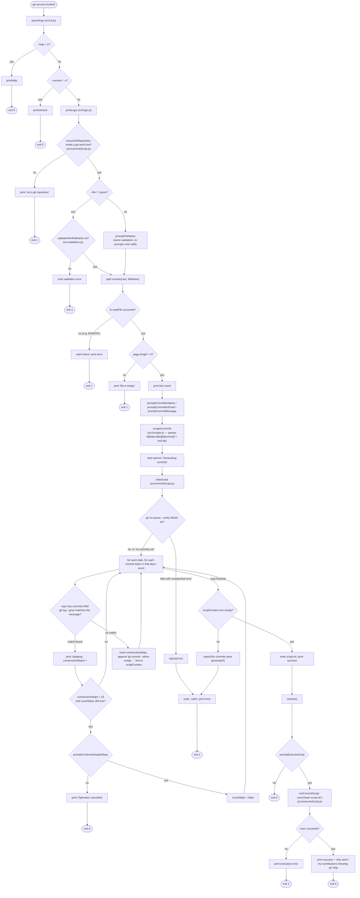

# Decision Tree

A map of every branch in the `git-synced` CLI flow, kept in sync with the code as the tool grows.

> **Keep this updated.** Any time you add a new prompt, flag, or branch to the flow, update the diagram and the matching entry below in the same change.

## Flow diagram

## Walkthrough

| Node | Responsible code | Outcome |
| --- | --- | --- |
| `--help` / `-h` | `parseArgs`, `printHelp` in `src/cli.js` | Prints usage, **exit 0**. Runs before the logo or any git/file access. |
| `--version` / `-v` | `parseArgs`, `printVersion` in `src/cli.js` | Prints `package.json` version, **exit 0**. |
| Not a git repository | `ensureGitRepository` in `src/commitScript.js` (`git rev-parse --is-inside-work-tree`) | Prints a friendly error and **exit 1**, before any prompts run. This is the first real gate once the tool is installed globally and can be run from any directory. |
| `--file` given but invalid | `validateHtmlFileName` in `src/validators.js`, checked directly in `index.js` | Prints the validation message (empty value or missing `.html` suffix) and **exit 1**. |
| `--file` given and valid / no `--file` | `path.resolve(process.cwd(), fileName)` in `index.js` | Resolved relative to the user's current working directory (not the package install directory) or used as-is if already absolute. |
| HTML file missing/unreadable | outer `try/catch` around `fs.readFile` in `index.js` | Prints the raw fs error, **exit 1**. |
| HTML file empty | `index.js`, right after `fs.readFile` | Prints "The file is empty.", **exit 1**. |
| Committer name / email / commit message prompts | `src/prompts.js` | Re-prompt on invalid input (empty name, malformed email); no exit path — these only proceed once valid. |
| Scraping | `scrapeCommits` in `src/scraper.js` | Parses `td[data-date][data-level]` cells + matching `tool-tip` text into a `Map<date, count>`. Zero days found is not an error — it flows through and simply produces an empty `scriptContent` later. |
| `git rev-parse --verify HEAD` fails unexpectedly | `writeScript` in `src/commitScript.js` | Rejects the promise with the raw git error, caught by the outer `.catch` in `index.js`, **exit 1**. |
| Commit already exists (`git log --grep` match) | `writeScript` loop | Skipped, printed as "Skipping commit that already exists", `consecutiveSkips` incremented. This is what makes re-running the tool against the same HTML idempotent. |
| More than 20 consecutive skips | `writeScript`, via `promptContinueDespiteSkips` in `src/prompts.js` | Asks the user to confirm the HTML content is correct. Decline → "Operation cancelled.", **exit 0**. Accept → skip-counting is disabled for the rest of the run (`countSkips = false`) so the prompt won't fire again. |
| No new commits generated at all | `writeScript` | Rejects with `'No commits were generated.'`, caught by the outer `.catch`, **exit 1**. |
| Commits generated | `writeScript` | Writes `script.sh` to the current directory, prints success, resolves. |
| Execute-script confirmation declined | `promptExecuteScript` in `src/prompts.js`, handled in `index.js` | **exit 0** — `script.sh` is left on disk for the user to inspect/run manually. |
| Execute-script confirmation accepted, `bash script.sh` fails | `runCommitScript` in `src/executeScript.js` | Prints the execution error and calls **exit 1** directly (not via promise rejection — matches the original inline behavior). |
| Execute-script confirmation accepted, succeeds | `runCommitScript` | Prints stdout/stderr, success message, `git push` reminder, and the GitHub "contributions not showing up" guidance. **exit 0**. |
