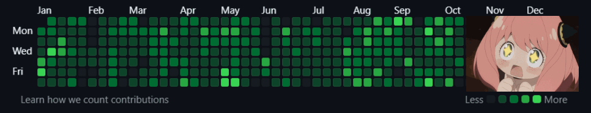

[](https://github.com/tc39/ecma262) [](https://forthebadge.com) [](https://forthebadge.com)

# git-synced



`git-synced` is a tool that generates empty commits by mirroring the commit history from a secondary GitHub profile to plot contributions on your primary account.

## How to use

1. Clone this repository

   ```bash
   git clone https://github.com/apappas1129/git-synced.git
   ```

   ※ **Do not fork**, as [commits pushed to a forked repository will not count as contributions](https://docs.github.com/en/account-and-profile/setting-up-and-managing-your-github-profile/managing-contribution-settings-on-your-profile/why-are-my-contributions-not-showing-up-on-my-profile#commits).

2. Browse to your secondary GitHub account's profile page and ensure that your desired date range of contributions graph is correctly set.

   For example, set the parameters `from=2024-01-01&to=2024-12-31`.

   ```text
   https://github.com/apappas1129?tab=overview&from=2024-10-01&to=2024-10-18
   ```

3. Save the entire HTML of the profile page as `index.html` (or your preferred filename) in the same directory as `index.js`.
4. Install dependencies, run the script, and follow the prompts.
   ```bash
   npm i
   npm start
   ```

## Why are my contributions not showing up?

- Commits made less than 24 hours ago may not appear immediately.
- Ensure your commits meet GitHub's criteria for contributions.

※ See [GitHub Docs - Contributions that are counted](https://docs.github.com/en/account-and-profile/setting-up-and-managing-your-github-profile/managing-contribution-settings-on-your-profile/why-are-my-contributions-not-showing-up-on-my-profile#contributions-that-are-counted)

## Important Notes

- This script creates empty commits and does not transfer any actual code or content.
- Excessive or inappropriate use of this tool could be seen as gaming the system and may have consequences for your GitHub account.

## Ethical Considerations

- Only use this tool to consolidate your own contributions from multiple accounts.
- Do not use this to misrepresent your activity or skills on GitHub.
  Respect the integrity of the GitHub contribution graph as a reflection of actual work and collaboration.

---

This repository is created after [**isturiz/sync-graph**](https://github.com/isturiz/sync-graph). If your secondary GitHub account is accessible publicly, I recommend using this tool instead to skip the need to manually create the HTML file containing your secondary account's contribution graph.
