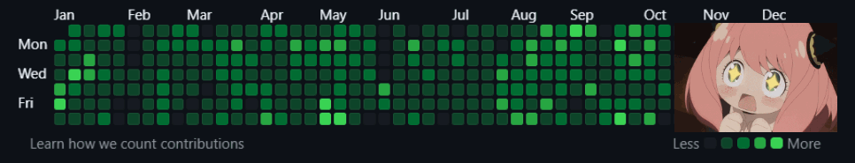

[](https://github.com/tc39/ecma262) [](https://forthebadge.com) [](https://forthebadge.com)

# git-synced



`git-synced` is a tool that generates empty commits that mirror the contribution graph from a secondary GitHub profile, plotting those contributions on your primary account.

## How to use

`git-synced` is a CLI you run from inside the git repository you want the mirrored commits added to — this should be a repository of your own, tied to your **primary** GitHub account. It does not need to be related to this tool's source in any way.

1. Browse to your secondary GitHub account's profile page and ensure that your desired date range of contributions graph is correctly set.

   For example, set the parameters `from=2024-01-01&to=2024-12-31`.

   ```text
   https://github.com/apappas1129?tab=overview&from=2024-01-01&to=2024-12-31
   ```

2. Save the entire HTML of the profile page anywhere on disk, e.g. `profile.html`.
3. `cd` into the git repository you want the commits created in, then run the tool with no install:

   ```bash
   npx @apappas1129/git-synced
   ```

   Or install it globally once and reuse the `git-synced` command anywhere:

   ```bash
   npm i -g @apappas1129/git-synced
   git-synced
   ```

4. Follow the prompts. When asked for the HTML file, point it at the file you saved in step 2 (a relative or absolute path both work).

### Flags

| Flag | Description |
| --- | --- |
| `-f, --file <path>` | Path to the saved GitHub profile page HTML. Skips the interactive file-name prompt. |
| `-v, --version` | Print the version number. |
| `-h, --help` | Show usage information. |

```bash
git-synced --file ./profile.html
```

## Why are my contributions not showing up?

- Commits made less than 24 hours ago may not appear immediately.
- Ensure your commits meet GitHub's criteria for contributions.

※ See [GitHub Docs - Contributions that are counted](https://docs.github.com/en/account-and-profile/setting-up-and-managing-your-github-profile/managing-contribution-settings-on-your-profile/why-are-my-contributions-not-showing-up-on-my-profile#contributions-that-are-counted)

## Important Notes

- This script creates empty commits and does not transfer any actual code or content.
- Excessive or inappropriate use of this tool could be seen as gaming the system and may have consequences for your GitHub account.

## Ethical Considerations

- Only use this tool to consolidate your own contributions from multiple accounts.
- Do not use this to misrepresent your activity or skills on GitHub.
  Respect the integrity of the GitHub contribution graph as a reflection of actual work and collaboration.

---

This repository is created after [**isturiz/sync-graph**](https://github.com/isturiz/sync-graph). If your secondary GitHub account is accessible publicly, I recommend using this tool instead to skip the need of manually creating the HTML file containing your secondary account's contribution graph.
